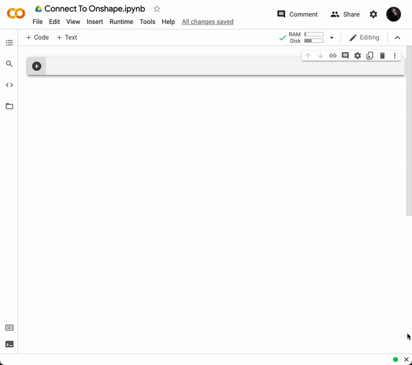
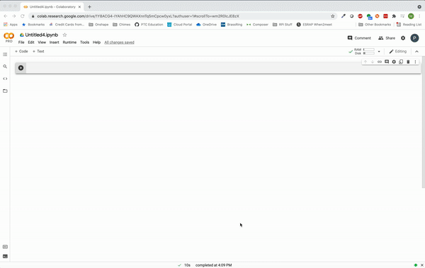

## PTC-API-Playground

Welcome to the PTC API Playground! In this repository, you will find:

0. [Overview](https://github.com/PTC-Education/PTC-API-Playground#0-overview)
1. [Onshape API Snippets](https://github.com/PTC-Education/PTC-API-Playground#1-onshape-api-snippets)
2. [ThingWorx API Snippets](https://github.com/PTC-Education/PTC-API-Playground#2-onshape-api-snippets)
3. [PTC Colab Library](https://github.com/PTC-Education/PTC-API-Playground#3-PTCColab-library)
4. [Example Notebooks](https://github.com/PTC-Education/PTC-API-Playground#4-example-notebooks)

---

## 0. Overview
**WELCOME TO THE PTC PLAYGROUND!**

The goal of this project is to enable anyone to get started with creating simple Python apps that connect to Onshape and ThingWorx REST API's. We've created a number of "snippet libraries" that show you how to use API keys to get and set information with Python notebooks. These libraries and example python notebooks are hosted in Google Colab, a web hosted version of Jupyter Notebooks.

The simplest way we've found for using the snippets is to add them as a custom snippet library in Google Colab as shown below. Then you can click on the arrows to insert them into your new Pyton notebook.

1. Open a document in [Google Colab](https://colab.research.google.com/). 
2. In the toolbar at the top (left) of your Google Colab you can go into the Tools > Settings > Sites Menu
3. Copy the Master Snippets Library URL (click [here for the Onshape API Snippets URL](https://colab.research.google.com/github/PTC-Education/PTC-API-Playground/blob/main/Onshape_API_Snippets.ipynb) or [here for the ThingWorx API Snippets URL](https://colab.research.google.com/github/PTC-Education/PTC-API-Playground/blob/main/ThingWorx_API_Snippets.ipynb)) into the "Custom Snippet notebook URL box".
4. Hit save!
5. You can now open the snippets library in the menu on the left with the angled brackets: "<>". This is where all of the default snippets and the snippets from the "master snippets library" are.
6. Add them to your document!

--- 

## 1. Onshape API Snippets
[Click here](https://colab.research.google.com/github/PTC-Education/PTC-API-Playground/blob/main/Onshape_API_Snippets.ipynb) to see the latest version of the Onshape API Snippets library. The first step is to use snippet 0.1 to import the Onshape Client.

Then you will need to create API Keys from [Onshape's Developer Portal.](https://dev-portal.onshape.com/) These keys can either be put directly in snippet 0.2 of the library, or saved in a file called "colabkeys.py" with the following format and used with snippet 0.3 (all api keys below are fake or have been deleted - replace with your own).

    access = 'Z97asb1257FkEwzp3EmCpa'
    secret = 'nHwN3q7asdvg4aryFC9rxYyo9U4o415WokYa8VOQ9YfUh4Zx'

--- 

## 2. ThingWorx API Snippets

[Click here](https://colab.research.google.com/github/PTC-Education/PTC-API-Playground/blob/main/ThingWorx_API_Snippets.ipynb) to see the latest version of the ThingWorx API Snippets library. [Click here](http://support.ptc.com/help/thingworx_hc/thingworx_8_hc/en/index.html#page/ThingWorx/Help/REST_API/ThingWorxRESTAPI.html) to learn more about the ThingWorx REST API.

To get started with ThingWorx REST API, you will need an API key and make sure that it has the propper permissions for the entities you want to access. [There are instructions here](https://support.ptc.com/help/thingworx_hc/thingworx_8_hc/en/index.html#page/ThingWorx/Help/Composer/Security/ApplicationKeys/ApplicationKeys.html) for learning how to generate an appkey and give it proper permissions.

---

## 3. PTC Colab Library

We have created a custom Python Library/Package called [PTCColab](https://github.com/PTC-Education/PTCColab) to simplify some of the complexities involved with using the Onshape and ThingWorx REST API's. [Click here](https://github.com/PTC-Education/PTC-API-Playground/blob/main/PTCColab_API_Snippets.ipynb) to see the latest version of the snippets library that uses the PTCColab library.

PTCColab was built with the intention of being a springboard for app development that use the Onshape API with basic connections to the Thingworx API. PTCColab can be used in any Python3 REPL however, PTC-API-Playground has been designed to work seemlessly with Google Colab, the Google Hosted Jupyter Notebook environment. The examples/"master snippet library" can be referenced for any Python Notebook or script. Specific documentation for PTCColab can be found [here](https://github.com/PTC-Education/PTCColab#table-of-contents). Happy Hacking!

General Tips:
- To connect to PTCColab using Snippets 1.1 is required to import the PTCColab library
- 1.2 is required to connect to any Onshape connection with PTCColab.
- 1.7 is required to connect to any Thingworx connection with PTC Colab.
- For any function in PTC Colab, there is probably an optional boolean parameter called "verbose" which will give you more information into the black box. (Although you can see the implementation directly in the PTCColab repository.)
- Happy hacking!

---

## 4. Example Notebooks

Below are some examples of how the snippets libraries have been used to create simple services or applications with Onshape and ThingWorx. NOTE: You will need to upload your own app keys and document parameters to run the example notebooks.

- [Click here](https://colab.research.google.com/github/PTC-Education/PTC-API-Playground/blob/main/Transformation_Matrices_Lesson.ipynb) to see a notebook designed to teach the basics of the math behind transformation matrices with Onshape
- [Click here](https://colab.research.google.com/github/PTC-Education/PTC-API-Playground/blob/main/Onshape_Countdown_DX_in_Education_Summit.ipynb) to see a notebook that updates a counter text in Onshape
- [Click here](https://colab.research.google.com/github/PTC-Education/PTC-API-Playground/blob/main/Octoprint_ThingWorx.ipynb) to see a notebook that sends information between an Octoprint server running on your local network and ThingWorx.